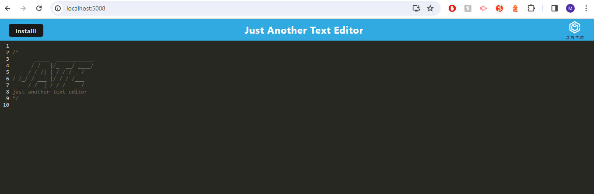

# Offline Text Editor

## Table of Contents

- [Description](#description)
- [Built With](#built-with)
- [Getting Started](#getting-started)
- [Usage Instructions](#usage-instructions)
- [License Section](#license)
- [Contact](#contact)

## Description

This application enhances an existing text editor by incorporating PWA capabilities, enabling it to operate seamlessly offline. 

(<a href="#readme-top">back to top</a>)

## Built With

- HTML
- CSS
- Express.js
- Node.js
- JavaScript
- Render (for deployment)

(<a href="#readme-top">back to top</a>)

## Getting Started

### Node.js Installation

To check if you already have Node.js installed on your computer, enter node -v in the command line. If successful, the command prompt will return a version number. Otherwise, please install Node.js at https://nodejs.org/en/ and clicking on the LTS version. If you are on Windows, make sure to look for the section that says `Download for Windows (x64)`. If you are using macOS, make sure to look for the section that says `Download for MacOS (x64)`

### Clone the Repo

Once Node.js has been successfully installed, click on the green "<> Code" button and copy the link of the repo. Head over to your code editor and open the terminal. In the terminal, "cd" into the directory you want this repo to be cloned into. Once in the folder, type "git clone" and paste the link copied. The complete repo will be successfully cloned into your folder when entered.

### Express.js

You must also install the Express.js npm package to run the server. Since Express.js is an npm package instead of being built directly into node.js, you must type `npm init` into the command line to allow npm packages to be installed. Next, go to the server.js file, and in the command line, type `npm install express` to install Express.js on your computer. For documentation on Express.js follow this link https://expressjs.com/en/4x/api.html.

(<a href="#readme-top">back to top</a>)

## Usage Instructions

1. Upon completing the installation steps, execute npm i to install the required dependencies. 

2. Subsequently, launch the server by running npm run start.

3. Navigate to http://localhost:5008/ to run this application on your local machine. 

4. On the other hand, you can also access the deployed applicaton at: (The page should open up as per below:)

(<a href="#readme-top">back to top</a>)

## License

Permission to use this application is granted under the MIT license.
Click on the link for more information: [MIT License Information](https://opensource.org/licenses/MIT)

(<a href="#readme-top">back to top</a>)

## Contact Me

GitHub Link: https://github.com/miloyang 
Email Address: <miloyang9@gmail.com> 
LinkedIn: https://www.linkedin.com/in/miloyang

(<a href="#readme-top">back to top</a>)

